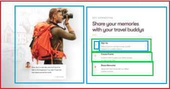

# Travellers Home Page

Layout excercise made with CSS. This is a replica of a dribble project of a tours application.

## Table of contents

- [Overview](#overview)
  - [The challenge](#the-challenge)
  - [Screenshot](#screenshot)
  - [Links](#links)
- [My process](#my-process)
  - [Built with](#built-with)
  - [What I learned](#what-i-learned)
- [Author](#author)

## Overview

### The challenge

Replicate layout by building similar images and using the same grid

### Screenshot

  
💻 Desktop

  

### Links

- Live Site URL: [Travellers home page](https://themattfire.github.io/Exercise_draw-a-point/)

## My process

### Built with

- CSS

I used CSS Flexbox to make the layout

- Illustrator

I used illustrator to recreate some of the background images

- Photoshop

I used Photoshop to recreate and clean some images

  
💡 Bulding the layout

  These are some of the images I used in my first aproach: Structure every part of the website as containers to make the layout easier to understand. Some of them changed according to the discovered necessities
  
  
  
  

### What I learned

I practice my habilities doing layout and explored options with icons and buttons. Also learned how to style a checkbox as a switch.

## Author

- Github - [@themattfire](github.com/themattfire)